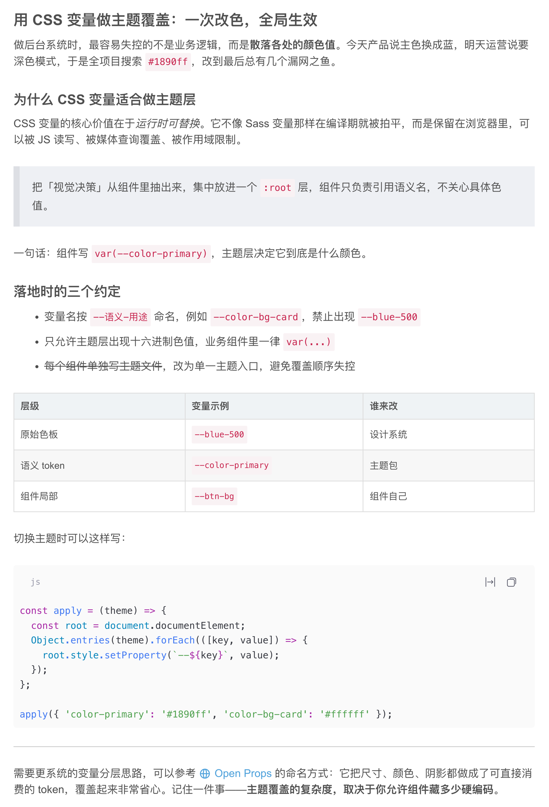
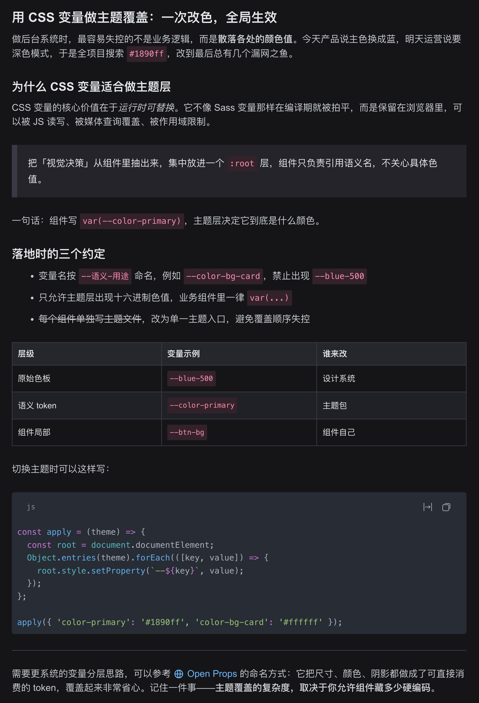

# dsh-csdn-theme

> 把 CSDN 博文的正文排版搬进 DeepSeek Harness 网页端 —— 标题层级、引用块、表格、行内代码、代码块一次对齐，浅色深色各一套。

[](LICENSE)
[](https://github.com/d0ublecl1ck/dsh-csdn-theme)






两张图是在 DSH Desktop 里用本主题渲染的真实截图（同一段 Markdown，只切换了宿主的浅色/深色偏好）。

## 你什么时候需要它？

- 你把 CSDN 上的技术笔记复制进 DSH，标题和正文挤成一片，长文读起来累。
- 你习惯了 CSDN 博文页的正文密度：段间距 24px、引用块有 8px 粗左边、表格是实线网格、行内代码是粉底红字。
- 你想在浅色和深色下保持同一套阅读体验，而不是只换一层外壳色。

## 它会交付什么？

分两层，都由 [`client.js`](client.js) 在浏览器里完成，宿主半边是空的：

1. **token 覆盖层** —— `ctx.theme.overrideTokens('dsh-csdn-theme', TOKENS)`。每个 token 都给 `{ light, dark }` 两个值，覆盖品牌/文字/边框/底色等 `--dsw-alias-*`、Markdown 排版 `--dsw-font-markdown-*`、代码高亮 `--shiki-*`，以及本插件私有的 `--csdn-*`（供第二层取色）。
2. **元素级样式表层** —— 追加一个 `<style data-plugin="dsh-csdn-theme">`，补 token 表达不了的东西：引用块左粗边与灰底、表格实线网格与斑马纹、图注、列表缩进、外层链接悬停色等。

两层都可撤销：停用插件即整层还原。

| 面 | 覆盖内容 |
| --- | --- |
| 品牌与交互 | 品牌色 `#fc5531`、主按钮三态、悬停/选中底色、链接常态/focus/visited |
| 正文排版 | 正文 16/24、h1–h6 的字重与行高、加粗/斜体/下划线/删除线、段落间距 |
| 块级元素 | 引用块、表格（网格 / 表头底色 / 斑马纹）、分隔线、图片与图注、定义列表 |
| 代码 | 行内代码 `#c7254e` on `#f9f2f4`、代码块圆角与底色、Atom One Light / Dark 语法高亮 |

## 快速开始

从 GitHub 装：

```sh
dsh plugin --profile web add github:d0ublecl1ck/dsh-csdn-theme
```

重启 `dsh web`，或在 DSH Desktop 里刷新页面。

装本地副本：

```sh
git clone https://github.com/d0ublecl1ck/dsh-csdn-theme
dsh plugin --profile web add ./dsh-csdn-theme
```

卸载：

```sh
dsh plugin --profile web remove dsh-csdn-theme
```

## 怎么确认生效

打开任一含 Markdown 的会话，看三点：

1. 行内代码是粉底红字（`#c7254e` on `#f9f2f4`），不是灰色块。
2. 引用块左侧有一条 8px 的灰色粗边。
3. 表格是实线网格，表头有浅色底。

还可在浏览器控制台执行 `document.querySelector('style[data-plugin="dsh-csdn-theme"]')`，返回该元素即表示样式层已注入。

## 取值来源（2026-10-03 实测）

配色取自 csdn.net 线上样式表 `csdnimg.cn/release/cmsfe/public/css/common.7303c5f0.css` 的出现频次统计：品牌色 `#fc5531` 出现 151 次，另有 `#222226` / `#555666` / `#999aaa` / `#ccccd8` 文字阶、`#e8e8ed` / `#f0f0f5` 边框阶、`#f5f6f7` 页面底色。

正文排版取自 CSDN 博文页 `#content_views`（`.markdown_views` / `.htmledit_views`）的计算样式与样式表：

| 元素 | CSDN 实测 |
| --- | --- |
| 正文 | 16px / 24px，`#4d4d4d`，段落下边距 24px |
| h1、h2 | 22px / 32px，字重 600，`#4f4f4f`，外边距 24px 0 8px |
| h3 / h4 / h5 / h6 | 20/30、18/28、16/26、16/24 |
| 加粗 `strong` | 字重 700 |
| 斜体 `em, i, cite, dfn, var` | italic |
| 下划线 `u` | underline |
| 删除线 `s, del` | line-through |
| 链接 `a` | `#4ea1db`，常态无下划线；hover `#ca0c16`；visited `#6795b5` |
| 行内代码 | `#c7254e` on `#f9f2f4`，内边距 2px 4px，圆角 2px，Source Code Pro |
| 引用块 | 背景 `#eef0f4`，左边框 8px `#dddfe4`，内边距 16px |
| 表格 | 单元格 1px `#dddddd`、内边距 8px、14px/22px；表头底色 `#eff3f5`、字重 700；偶数行 `#f7f7f7` |
| 分隔线 | 1px 实线 `#cccccc`，外边距 24px 0 |
| `kbd` | 白底、1px `rgba(63,63,63,.25)`、`0 1px 0` 阴影、圆角 4px |
| 代码块 | 底色 `#fafafa`，圆角 5px，Source Code Pro 14px/22px |
| 语法高亮 | Atom One Light（深色 Atom One Dark），取自 CSDN 文章实际加载的 highlight 样式 |

字号没有写死：Markdown 的字号/行高按 CSDN 的比例跟随 `--dsh-content-font-size`，所以设置里的「字号大小」仍然有效。

## 安全边界

- 不改 DOM 结构、不注册设置项、不发网络请求、不读写文件、不 spawn 子进程。
- 只做两件事：往 `<body>` 叠一层 token 覆盖，往 `<head>` 追加一个 `<style>`。
- 两层都通过 `ctx.effect` 注册 disposer，停用插件即整层还原，不留残留。
- 零运行时依赖、无构建步骤、无 `prepare` 脚本，从 GitHub 安装不需要额外授权构建。

## 已知边界

- 只做视觉覆盖；开关就是启用/停用这个插件。
- `compact` 变体（工具输出等小字号区域）不覆盖，避免影响可读性。
- 深色侧不是 CSDN 官方换肤（站点未公开深色 token），是按同一套语义调出的深色值。
- h5/h6 在 DSH 里没有独立的 `--dsw-font-markdown-*` token：本插件只对齐了它们的外边距与颜色。
- `u` 与 `kbd` 规则针对真实 `<u>` / `<kbd>` 元素。DSH 的 Markdown 渲染器会转义原始 HTML，所以对话正文里这两条通常不会触发，保留是为了其他会产出真实元素的场景。
- 尚未验证：DSH 早于 0.1.7 的版本；样式表作用域依赖宿主 CSS Module 的 `_markdown_<hash>` 命名。

## 作用域

Markdown 根类在构建产物里形如 `_markdown_1ypvv_5`，样式表用 `[class*="_markdown_"]:not([class*="_compact_"])` 命中：换构建哈希仍然命中，而 `compact` 变体不参与覆盖。代码块用 DSH 的稳定全局钩子 `md-code-block`。

## 文件

| 文件 | 作用 |
| --- | --- |
| `package.json` | 声明 `dsh.bundle.patch` 与 `dsh.client` |
| `cordis.patch.yml` | 往 profile 插入一行 `csdn-theme` |
| `index.js` | 宿主半边，空 `apply` |
| `client.js` | 调色板、字体 token、语法高亮 token、元素级样式表 |
| `screenshots.json` | 声明市场详情页要展示的截图 |
| `assets/` | 上面两张真实截图 |
| `scripts/capture-screenshots.mjs` | 重录那两张截图的完整链路 |
| `test/client.test.mjs` | 7 条单测：模块契约、token 形状与命名空间、字号轴、高亮取值、样式表注入与清理 |

## 本地验证

```sh
npm test
```

## 想改

- 颜色：`client.js` 顶部的 `LIGHT` / `DARK` 两张表。
- 排版比例与字重：`TOKENS` 里的 `--dsw-font-markdown-*`。
- 元素级规则：`client.js` 里的 `RULES` 与 `CODE_BLOCK_RULES`。

改完跑 `npm test`，再重启宿主或刷新页面。

## 许可

MIT
